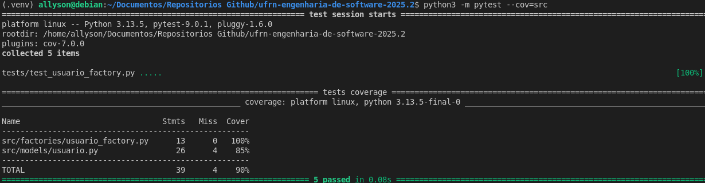

# Relatório de Testes de Unidade

Este documento descreve os testes de unidade criados para o projeto "Meu Posto de Saúde".

## 1. Ferramentas Utilizadas

Para garantir a qualidade e a corretude do código, utilizamos os seguintes frameworks de teste do ecossistema Python:

* **Pytest:** Um framework de testes moderno que facilita a escrita de testes simples e escaláveis.
* **Pytest-Cov:** Um plugin para o Pytest que mede a cobertura de código, mostrando quais linhas do nosso backend foram (ou não) executadas pelos testes.

## 2. Classe Testada: `UsuarioFactory`

Escolhemos a classe `src/factories/usuario_factory.py` para o teste de unidade.

**Justificativa:** Esta classe possui a lógica de negócios mais clara e "testável" do nosso MVP. Ela tem uma única responsabilidade (criar usuários) com múltiplas condições (se é paciente, médico, etc.) e cenários de falha claros (tipo desconhecido, dados faltando). Isso a torna a candidata ideal para um teste de unidade.

## 3. Explicação dos Testes

O arquivo `tests/test_usuario_factory.py` contém **5 testes de unidade** (`collected 5 items`) que cobrem todos os cenários da fábrica:

1.  **`test_cria_paciente_com_sucesso`**: Verifica se a fábrica instancia corretamente um objeto da classe `Paciente`.
2.  **`test_cria_medico_com_sucesso`**: Verifica se a fábrica instancia corretamente um objeto da classe `Medico`.
3.  **`test_cria_enfermeiro_com_sucesso`**: Verifica se a fábrica instancia corretamente um objeto da classe `Enfermeiro`.
4.  **`test_falha_com_tipo_desconhecido`**: Garante que o sistema levanta um `ValueError` se um tipo de usuário que não existe for solicitado.
5.  **`test_falha_com_dados_faltando`**: Garante que o sistema levanta um `ValueError` se dados obrigatórios (ex: "cartao_sus") não forem fornecidos.

## 4. Resultado

Abaixo está o resultado da execução dos 5 testes e do relatório de cobertura, conforme obtido no terminal:

## 5. Análise de Cobertura

Conforme o print screen, todos os **5 testes passaram** (`5 passed in 0.08s`).

O relatório de cobertura (`pytest --cov=src`) mostra que a classe-alvo do teste, **`src/factories/usuario_factory.py`**, atingiu **100% de cobertura** (13 de 13 declarações executadas).

Além disso, os testes de criação de objetos também cobriram **85%** da classe de modelo (`src/models/usuario.py`), resultando em uma excelente cobertura **TOTAL** de **90%** para o projeto.

Isso satisfaz e excede o requisito solicitado de "no mínimo, 60% de cobertura" para a classe testada.