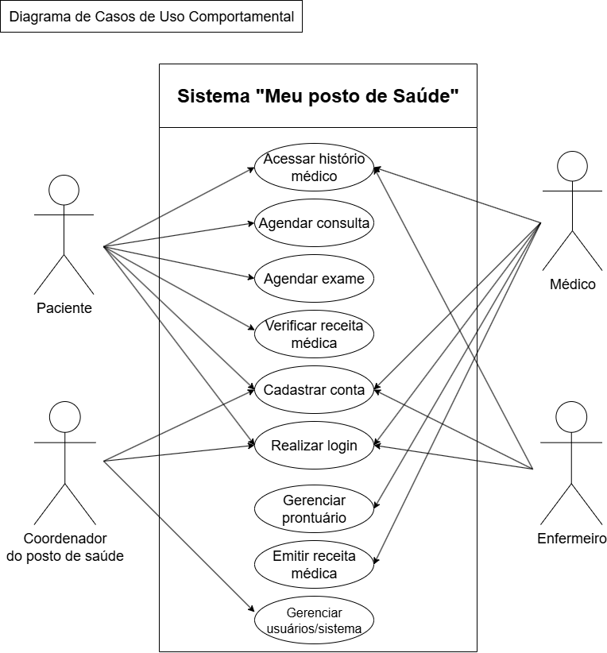

# Documentação dos Diagramas - Meu Posto de Saúde

## 1. Justificativa das Escolhas

Para garantir uma compreensão clara e abrangente do sistema, tanto da sua estrutura estática quanto do seu comportamento dinâmico, optamos por utilizar um conjunto de diagramas estruturais e comportamentais.

* **Diagrama Estrutural - Diagrama de Classes:** Foi escolhido para definir a lógica do sistema. Ele é fundamental para identificar as principais entidades (como `Paciente`, `Médico`, `Consulta`), seus atributos (dados que eles armazenam) e os relacionamentos entre eles. Este diagrama servirá como um guia direto para a construção do banco de dados e a implementação das classes no código, garantindo uma base sólida e organizada.

* **Diagrama Comportamental - Diagrama de Casos de Uso:** Foi escolhido por sua capacidade de oferecer uma visão de alto nível das funcionalidades do sistema sob a perspectiva do usuário final. Ele é excelente para definir o escopo do projeto e validar os requisitos com todas as partes interessadas. Como o nosso `README.md` e o arquivo de `historias-de-usuario.md` já definem diferentes tipos de usuários e suas necessidades, este diagrama é a ferramenta perfeita para visualizar essas interações de forma clara.

## 2. Diagramas Propostos

### 2.1. Diagrama de Casos de Uso

Este diagrama apresenta os atores que interagem com o sistema "Meu Posto de Saúde" e as principais funcionalidades que eles podem acessar.

* **Atores Identificados:**
    * **Paciente:** Principal usuário do sistema, busca autonomia para gerenciar sua saúde.
    * **Médico:** Responsável pelo atendimento clínico e documentação médica.
    * **Enfermeiro:** Apoia o atendimento e gerenciamento de informações do paciente.
    * **Administrador:** Gerencia o sistema e o cadastro dos demais usuários profissionais.

* **Casos de Uso (Funcionalidades):**
    * **Realizar Cadastro:** Permite que um novo paciente crie sua conta no sistema, conforme a **História de Usuário 1**.
    * **Realizar Login:** Funcionalidade essencial para todos os atores acessarem suas respectivas áreas no sistema.
    * **Agendar Consulta:** Permite ao paciente marcar consultas com base em especialidades e horários, conforme a **História de Usuário 2**.
    * **Agendar Exames:** Expande a funcionalidade de agendamento, conforme descrito no `README.md`.
    * **Acessar Histórico Médico:** Permite que o paciente e os profissionais de saúde consultem o prontuário.
    * **Emitir Receita Médica:** Funcionalidade exclusiva do médico para criar receitas digitais, conforme a **História de Usuário 3**.
    * **Verificar Receitas Médicas:** Permite que o paciente ou um farmacêutico acessem as receitas emitidas.
    * **Gerenciar Prontuário:** Ação dos profissionais de saúde para atualizar as informações clínicas do paciente.
    * **Gerenciar Usuários/Sistema:** Função do administrador para cadastrar e gerenciar os profissionais do posto de saúde bem como demais alterações dentro do sistema.

---